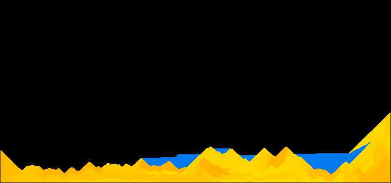

# Sand Simulation

Trying to implement a simple sand simulator (with other elements) in Raylib :)

#### Pre-requisites
1. [Raylib](https://github.com/raysan5/raylib)
2. [FFMPEG](https://ffmpeg.org/)

#### Usage
`make`

This will build the project. If it does not run the executable:
`./main`

#### Controls/Keybinds:

- `s` - Sand
- `w` - Water
- `h` - Solid
- `c` - Smoke
- Draw while holding `LSHIFT` to delete pixels
- `Enter` - Clear the screen
- `r` - toggle to send frames to ffmpeg
- `- and +` - decrease or increase particle brush size

---

#### Bugs to fix

(fix everything tbh but still)

1. Add interaction of water with sand
2. Add gravity and water physics
